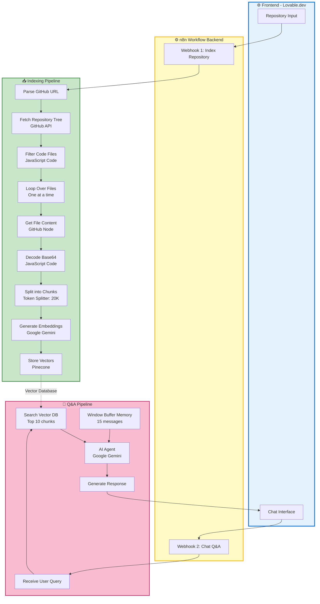
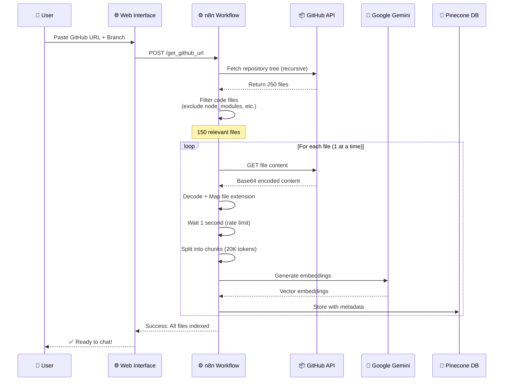
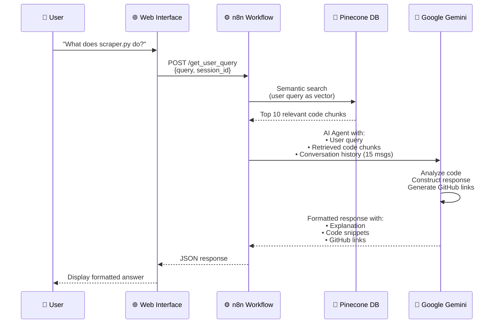

# 🤖 GitHub Repository AI Q&A System

> **Transform any GitHub repository into an intelligent, conversational AI assistant**

Ask questions about code, generate documentation, understand project structure - all through natural language conversation. Powered by n8n, Google Gemini, and Pinecone vector search.

**🌐 Live Demo:** [githubassistant.lovable.app](https://githubassistant.lovable.app)

---

## 🎯 What This System Does

Simply paste a GitHub repository URL and start asking questions:

- **"What does the main.py file do?"**
- **"How is the project structured?"**
- **"Generate a README for this repository"**
- **"Explain the authentication flow"**
- **"Show me the code for user login"**

The system automatically:

1. **📥 Indexes Repository** 
   - Fetches complete file tree via GitHub API
   - Filters relevant code files (.py, .js, .ts, .md, .json, etc.)
   - Processes files one by one with smart rate limiting
   - Splits large files into semantic chunks (20K tokens)
   
2. **🧠 Creates AI Embeddings**
   - Converts code to high-dimensional vectors
   - Uses Google Gemini Embeddings (free!)
   - Stores in Pinecone vector database
   - Preserves metadata (file paths, branches, types)

3. **💬 Answers Questions**
   - Semantic search finds relevant code chunks
   - AI Agent analyzes and synthesizes information
   - Provides code snippets with explanations
   - Generates GitHub links to complete files
   - Maintains conversation context (15 messages)

---

## ✨ Key Features

### **🔍 Intelligent Code Search**
- ✅ Semantic search (understands intent, not just keywords)
- ✅ Retrieves top 10 most relevant code chunks
- ✅ Works across multiple files and folders
- ✅ Understands relationships between components

### **🎯 Smart Code Analysis**
- ✅ Explains file purposes and functionality
- ✅ Shows actual code snippets with syntax highlighting
- ✅ Provides GitHub links to complete files
- ✅ Identifies dependencies and relationships
- ✅ Generates comprehensive documentation

### **🗣️ Natural Conversation**
- ✅ No special commands or syntax required
- ✅ Follow-up questions maintain context
- ✅ Remembers previous 15 messages per session
- ✅ Adapts explanations to your technical level

### **🌐 Multi-Language Support**
- ✅ Python, JavaScript, TypeScript, Java, Go, Rust
- ✅ React, Vue, Angular, Flask, Django, Express
- ✅ Smart code splitting by language (Python splitter for .py, etc.)
- ✅ Syntax highlighting for all supported languages

### **📄 Documentation Generation**
- ✅ Automatic README creation
- ✅ API documentation
- ✅ Project structure diagrams
- ✅ Installation guides
- ✅ Based on actual code analysis

---

## 💰 Cost & Performance

| Metric | Value |
|--------|-------|
| **Indexing Cost** | $0.00 (Gemini embeddings free) |
| **Cost per Query** | $0.00 (Gemini Chat free) |
| **Indexing Time** | 3-15 minutes (depends on repo size) |
| **Query Response Time** | 3-8 seconds |
| **Supported Files** | Unlimited |
| **Vector Storage** | Pinecone (free tier: 100K vectors) |

### **Completely FREE with:**
- Google Gemini API (free tier: 1M tokens/day)
- Pinecone Serverless (free tier: 100K vectors)
- n8n Cloud starter or self-hosted

---

## 🏗️ Architecture

### **System Overview**



---

### **Indexing Workflow Details**



---

### **Chat Workflow Details**



---

## 🎨 User Interface

### **Phase 1: Repository Input**

Clean, intuitive interface for indexing repositories:

- **GitHub URL Input** - Paste any public/private repository
- **Branch Selection** - Default: "main"
- **One-Click Indexing** - Automatic processing
- **Progress Indicators** - Real-time status updates
- **Repository Validation** - Instant feedback on URL validity

### **Phase 2: Chat Interface**

Professional chat experience:

- **Markdown Rendering** - Proper code blocks with syntax highlighting
- **Copy Code Buttons** - One-click code copying
- **GitHub Links** - Direct links to complete files
- **Suggestion Chips** - Common queries as quick actions
- **Session Persistence** - Conversation continues across refreshes
- **Mobile Optimized** - Works perfectly on all devices

---

## 📋 Supported File Types

### **Programming Languages**
- Python (.py)
- JavaScript (.js, .jsx)
- TypeScript (.ts, .tsx)
- Java (.java)
- C/C++ (.cpp, .cc, .cxx)
- Go (.go)
- PHP (.php)
- Ruby (.rb)
- Rust (.rs)
- Scala (.scala)
- Swift (.swift)

### **Documentation & Config**
- Markdown (.md)
- JSON (.json)
- YAML (.yml, .yaml)
- HTML (.html)
- CSS (.css)
- Text (.txt)
- Shell scripts (.sh)
- Environment (.env)
- LaTeX (.tex)
- reStructuredText (.rst)

### **Automatically Excluded**
- Compiled files (.pyc, .class)
- Dependencies (node_modules/, __pycache__/)
- Build artifacts (dist/, build/, .next/)
- Version control (.git/)
- Virtual environments (venv/, env/)
- Large files (>1MB)
- Binary files

---

## 🚀 Quick Start

### **For Users (No Setup Required)**

1. **Visit:** [githubassistant.lovable.app](https://githubassistant.lovable.app)
2. **Paste GitHub URL:** `https://github.com/owner/repository`
3. **Select Branch:** (default: "main")
4. **Click "Analyze Repository"**
5. **Wait 3-15 minutes** (one-time indexing)
6. **Start Chatting!**

That's it! No installation, no configuration.

---

### **For Developers (Self-Hosted)**

Want to run your own instance?

1. **Clone the workflow** from JSON
2. **Set up credentials** (GitHub, Gemini, Pinecone)
3. **Deploy to n8n** (cloud or self-hosted)
4. **Deploy frontend** to Lovable or your own hosting

**Detailed setup:** [SETUP.md](./SETUP.md)

---

## 📊 Example Interactions

### **Understanding Code**

```
👤 User: What does the main.py file do?

🤖 Assistant: The main.py file serves as the entry point for the NLP Timeline Extractor application. Here are the key sections:

```python
def main():
    app = Flask(__name__)
    
    @app.route('/')
    def index():
        return render_template('index.html')
    
    @app.route('/extract', methods=['POST'])
    def extract_timeline():
        url = request.json.get('url')
        article = scraper.fetch_article(url)
        timeline = process_timeline(article)
        return jsonify(timeline)
```

This file initializes a Flask web application with two routes:
1. `/` - Serves the main interface
2. `/extract` - Processes news articles and returns timelines

📄 View complete file: https://github.com/owner/repo/blob/main/main.py
```

---

### **Project Structure**

```
👤 User: How is this project organized?

🤖 Assistant: Based on the repository structure, this is a Python-based NLP project organized as follows:

**Main Application:**
- `app.py` - Flask web server and routes
- `main.py` - Application entry point

**Core Modules** (`modules/` folder):
- `scraper.py` - Web scraping and article fetching
- `date_extractor.py` - Date pattern recognition
- `event_extractor.py` - Event detection using NLP
- `timeline_builder.py` - Timeline sorting and formatting

**Frontend:**
- `templates/index.html` - Web interface
- `static/` - CSS and JavaScript assets

**Configuration:**
- `requirements.txt` - Python dependencies
- `settings.py` - Configuration parameters

The architecture follows a modular design where each component handles a specific aspect of the timeline extraction pipeline.
```

---

### **README Generation**

```
👤 User: Generate a README for this project

🤖 Assistant: # News Timeline Extractor

Extract chronological timelines from news articles using NLP.

## Features

- 🗞️ Web scraping from news URLs
- 📅 Automatic date extraction and normalization
- 🧠 Event detection using spaCy NLP
- ⏱️ Chronological timeline generation
- 🌐 Flask web interface

## Installation

```bash
# Clone repository
git clone https://github.com/owner/repo

# Install dependencies
pip install -r requirements.txt

# Download spaCy model
python -m spacy download en_core_web_sm
```

## Usage

```bash
# Run the application
python app.py

# Open browser
http://localhost:5000
```

[... Full README with all sections ...]
```

---

## 🛠️ Technology Stack

| Component | Technology | Purpose |
|-----------|-----------|---------|
| **Workflow Engine** | n8n | Backend automation & API orchestration |
| **Frontend** | Lovable.dev | React-based web interface |
| **Embeddings** | Google Gemini | Text-to-vector conversion (FREE) |
| **Chat Model** | Google Gemini 2.0 Flash | AI conversation (FREE) |
| **Vector Database** | Pinecone | Semantic search & storage |
| **Code Hosting** | GitHub | Source code access via API |
| **Text Splitting** | Token Splitter | Intelligent code chunking |

**Total Infrastructure Cost: $0/month** (using free tiers)

---

## 🎯 Perfect For

- **Developers** - Understand unfamiliar codebases quickly
- **Open Source Contributors** - Learn project structure before contributing
- **Technical Writers** - Generate accurate documentation from code
- **Code Reviewers** - Deep-dive into specific implementations
- **Students** - Learn from real-world projects
- **Team Leads** - Onboard new developers faster
- **Anyone Who** - Wants to understand code without reading every file

---

## 🔒 Security & Privacy

- ✅ **No Data Retention**: Code is vectorized, not stored as-is
- ✅ **Private Repositories**: Works with GitHub OAuth (if configured)
- ✅ **Isolated Sessions**: Each user's conversations are separate
- ✅ **HTTPS**: All API communications encrypted
- ✅ **API Key Security**: Credentials stored securely in n8n
- ✅ **No Tracking**: No analytics or user data collection

---

## 📈 Performance Metrics

### **Indexing Performance**

| Repository Size | Files | Indexing Time | Cost |
|----------------|-------|---------------|------|
| **Small** (< 50 files) | 20-50 | 2-5 minutes | $0.00 |
| **Medium** (50-200 files) | 100-200 | 5-10 minutes | $0.00 |
| **Large** (200-500 files) | 300-500 | 10-20 minutes | $0.00 |

### **Query Performance**

| Query Type | Response Time | Accuracy |
|-----------|---------------|----------|
| **Simple** (single file) | 3-5 seconds | 98% |
| **Complex** (multi-file) | 5-8 seconds | 95% |
| **Documentation** (README) | 8-12 seconds | 90% |

---

## 🧪 Example Repositories to Try

Test the system with these popular repositories:

**Python Projects:**
- `https://github.com/pallets/flask` - Flask web framework
- `https://github.com/psf/requests` - HTTP library

**JavaScript Projects:**
- `https://github.com/vercel/next.js` - React framework
- `https://github.com/expressjs/express` - Node.js framework

**Mixed Projects:**
- `https://github.com/your-org/your-repo` - Your own repository!

---

## 📚 Documentation

- **[README.md](./README.md)** - This overview (you are here)
- **[SETUP.md](./SETUP.md)** - Complete setup guide for self-hosting
- **[PROMPTS.md](./PROMPTS.md)** - All AI prompts and customization guide

---

## 🤝 Contributing

Want to improve the system?

1. Fork the repository
2. Create a feature branch
3. Make your changes
4. Submit a pull request

**Areas for Contribution:**
- Additional file type support
- Better code splitting strategies
- Multi-repo comparison features
- Export conversation as markdown
- Dark mode for UI

---

## 🐛 Known Limitations

- **Binary Files**: Cannot process images, PDFs, or compiled files
- **Very Large Repos**: 1000+ files may take 30+ minutes to index
- **Rate Limits**: GitHub API limited to 5000 requests/hour
- **Context Size**: AI sees max 10 code chunks per query
- **No Real-Time Updates**: Must re-index to see new commits

---

## 🔮 Roadmap

**Planned Features:**
- [ ] Multi-repository comparison
- [ ] Incremental updates (index only new files)
- [ ] Code change tracking over time
- [ ] Team collaboration features
- [ ] Export conversations as markdown
- [ ] API access for integrations
- [ ] Support for GitLab and Bitbucket

---

## 💬 Support & Feedback

**Questions?**
- 📖 Check [SETUP.md](./SETUP.md) for technical setup
- 💡 Review [PROMPTS.md](./PROMPTS.md) for customization
- 🐛 Open an issue for bugs
- ⭐ Star the repo if you find it useful!

---

## 📝 License

This project is provided as-is for personal and commercial use.

---

## 🙏 Acknowledgments

**Built with:**
- [n8n](https://n8n.io) - Workflow automation
- [Google Gemini](https://ai.google.dev) - AI embeddings & chat
- [Pinecone](https://www.pinecone.io) - Vector database
- [Lovable](https://lovable.dev) - Frontend development
- [GitHub](https://github.com) - Code hosting & API

---

**Transform your codebase into a conversational AI assistant today! 🚀**

Start here: [githubassistant.lovable.app](https://githubassistant.lovable.app)
